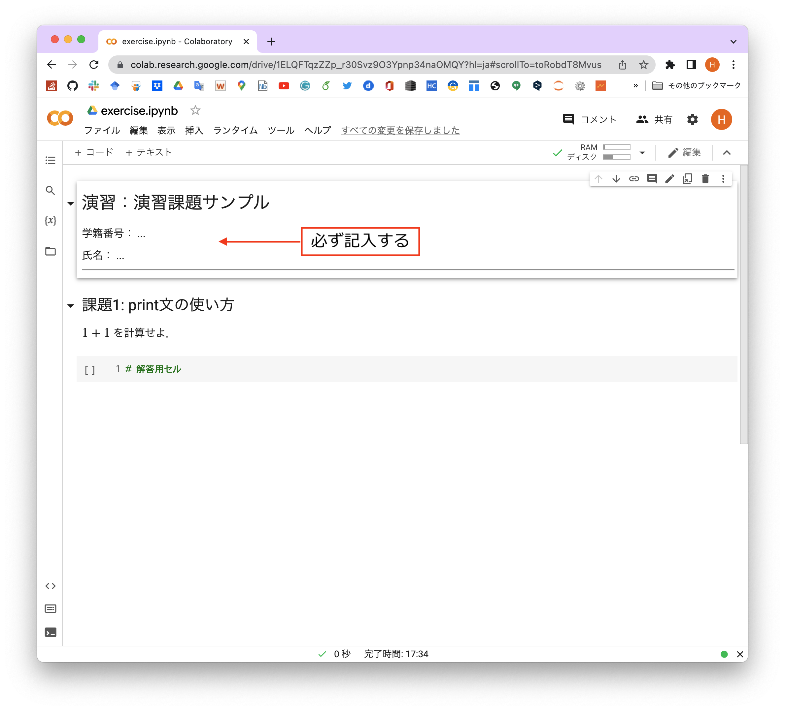
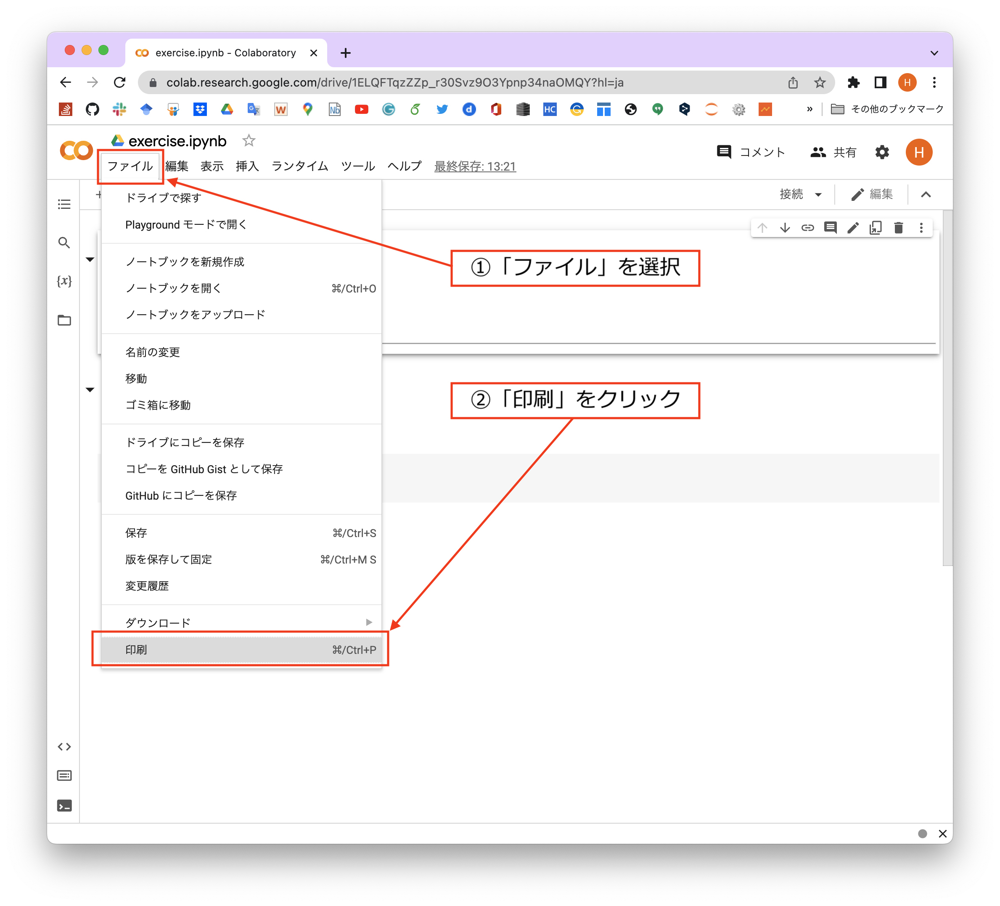
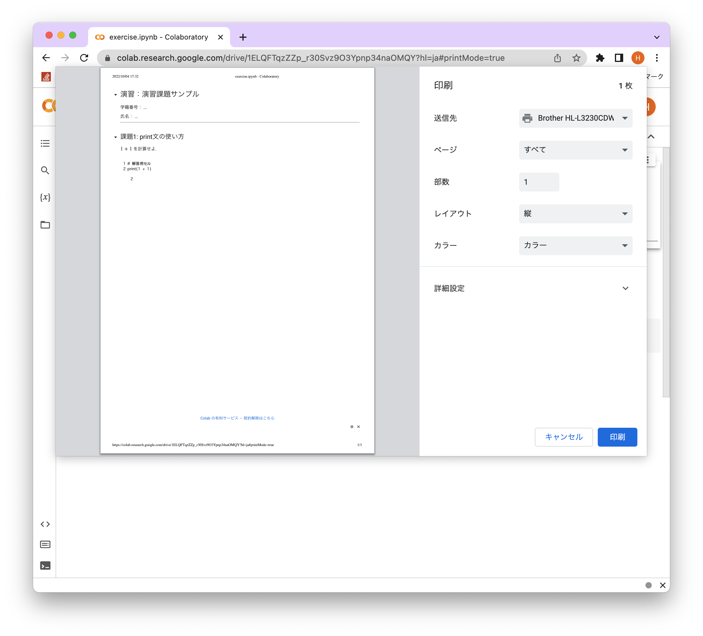
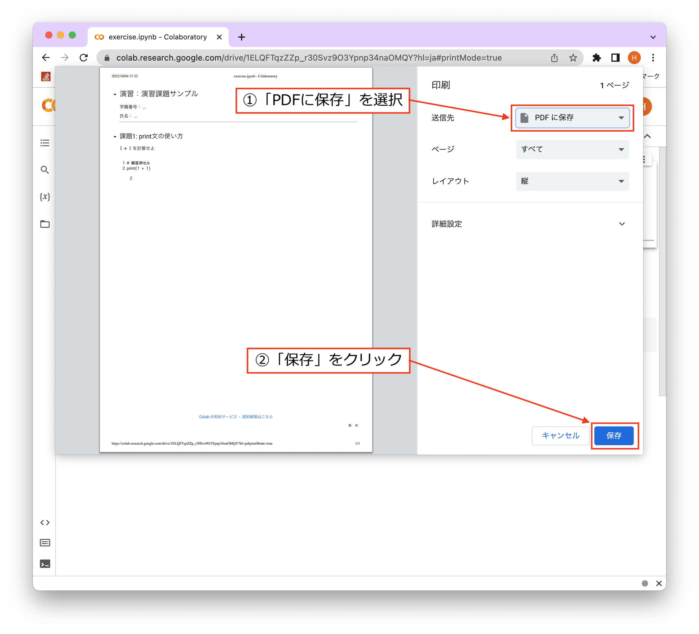
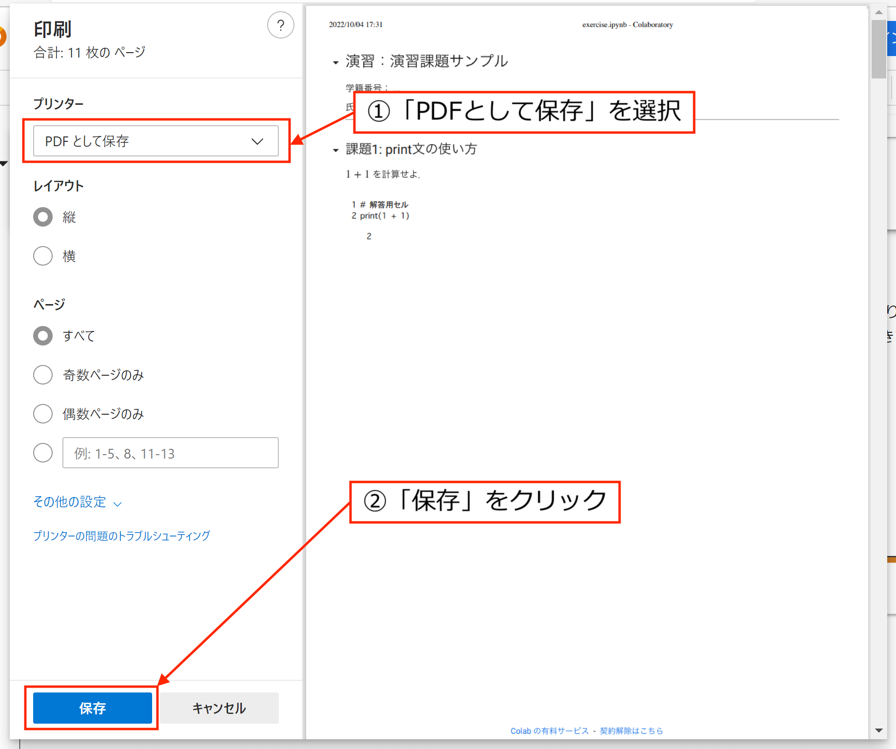
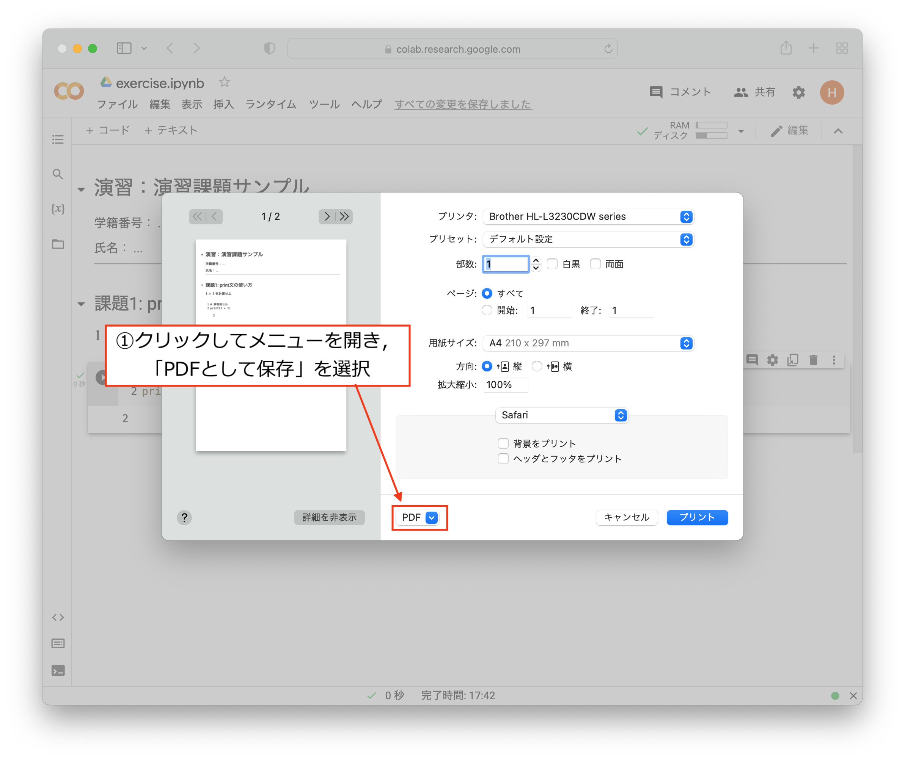
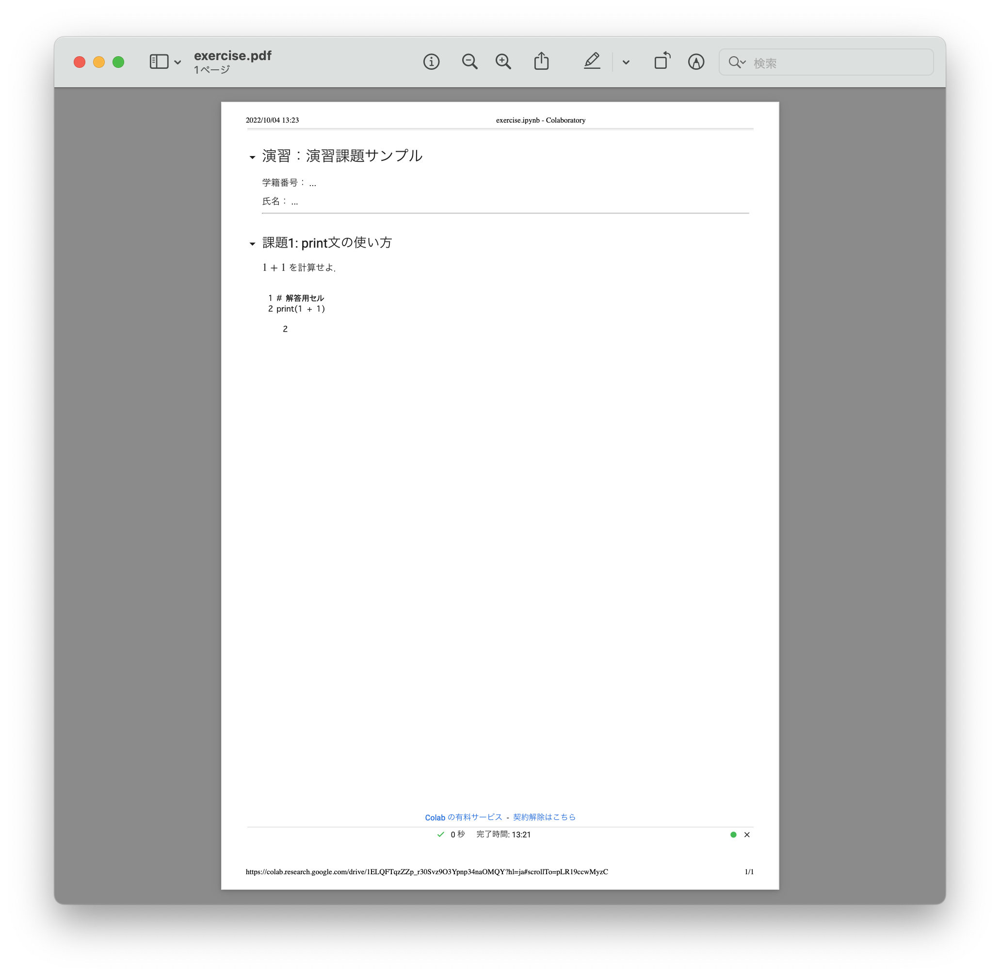

# 課題提出方法
「ゼロからはじめるプログラミング」では[成績評価]()にもあるように毎週の課題提出状況と期末試験の成績から総合的に評価します．このページでは課題提出方法を説明します．

## 課題提出の流れ
課題の提出は以下の手順で行います．

1. 月曜日に課題ページの公開と同時に **Teams** の課題機能から受講者へ課題が課されます．
2. 期限内に課題ページを解いてください．
3. 解いた Jupyter Notebook (.ipynb形式)を **PDF** ファイル (.pdf)に変換してください．
4. Teamsの課題提出フォームから変換したPDFファイルを提出してください．

詳細は以下に続きます．

---

## Teamsから課題を提出する．
課題提出の流れ，ステップ **1** と **4** に関する説明です．
1. 受講者は課題が作成されると **一般チャンネル** に以下のようなメッセージが通知されます．

    

2. 通知されたメッセージの課題の表示をクリックすると以下の提出フォームが表示されます．このステップはTeamsのメニューの課題からもアクセスできます．

    

3. 後述する作成した課題ファイル (.pdf形式) を **添付** をクリックし，**自身のデバイス** からアップロードしてください．

    

4. 最後に **提出** をクリックしてください．完了すると右上の **提出しました** となります．**アップロードしただけでは提出とならないのでご注意ください．** 提出を取り消して，新たな解答ファイルをアップロードすることも可能です．このときはステップ3の画面になります．

    

---

## 課題ファイルの作成方法
課題提出の流れ，ステップ **3** に関する説明です．

**課題ファイルの注意点**
- 提出ファイルは実行したJupyter Notebookをpdf化したファイルです．
- 実行したJupyter Notebookに科目名，学籍番号，氏名を記載してください．
- .ipynbファイルは受け付けません．

Jupyter Notebookのpdf化は以下の手順で作成してください．以下の手順はMacのGoogle Chromeの説明になります．Windowsでも見た目が異なるだけで同様の手順で作成可能です．

1. まず課題の作成します．演習回のページを開いてください．2通りの作成方法があります．

    1. **ロケットマークからGoogle Colabを直接開く方法**
    
        ロケットマークをクリックしてください．演習に対応するGoogle Colabが開きます．詳細はサポートページの [Google Colaboratoryを使った教材の開き方](https://ground-zero-programming.github.io/zero-pro2022-public/docs/01/introduction_and_setup.html#id6) に記載されています．
    
        **注意点**  
        このとき，ノートブックを操作した結果はGoogle Drive上に保存されません． ノートブックの上側にある「ドライブをコピー」というボタンを押せば，自分のGoogle Drive上にノートブックのコピーが作成されます．課題作成を中断したい場合は，必ずコピーを作成してください
    
    2. **Notebookをダウンロードする方法**
    
        ロケットマークのアイコンのある右端のアイコンをクリックすると演習課題の .ipynb ファイルをダウンロードできます．ダウンロードしたNotebookをGoogle Colabでアップロードすると演習に対応するGoogle Colabが利用可能な状態になります．アップロード手順は [ノートブックのアップロード](https://ground-zero-programming.github.io/zero-pro2022-public/docs/01/introduction_and_setup.html#id5) に記載されています．

2. 上記の手順で演習の .ipynb ファイルをGoogle Colabで開くと，Jupyter Notebookのトップに学籍番号と氏名の記入欄があります．編集して学籍番号と氏名を記入してください．

    

3. 解答用セルに課題を解いてください．必ずしも一つの解答用セルにプログラムを作成する必要はありません．

    

4. Google Colabのファイルをクリックすると **印刷** の項目があります．印刷をクリックしてください．

    

5. 印刷をクリックすると以下のような画面が出力されるはずです．

    

6. 送信先をクリックすると利用可能なプリンターに加えて **PDFに保存** という項目があるはずなのでクリックしてください．

    

    **注意**
    この画面は利用しているブラウザによって異なります．上記の例はGoogle Chromeでの画面です．

    Microsoft Edgeを利用している受講者は以下のような印刷プレビュー画面が出力されているはずです．

    

    Safariを利用している受講者は手順が異なります．印刷をクリックすると以下のような印刷プレビュー画面が出力されているはずです．プリンタではなく中央下にある **PDF** から **PDFとして保存** をクリックしてPDFを保存してください．

    

7. 送信先が **PDFに保存** となっていることを確認し，右下の **保存** をクリックしてください．パソコンにPDFファイルが保存されるはずです．保存場所とファイル名はわかりやすいように各自設定してください．保存されたPDFファイルが以下のように正しく出力されていることを確認してください．

    

    ステップ7はSafariを利用している受講者は必要ありません．

8. 作成したPDFファイルを前述した **Teamsの提出方法** に従って提出してください．